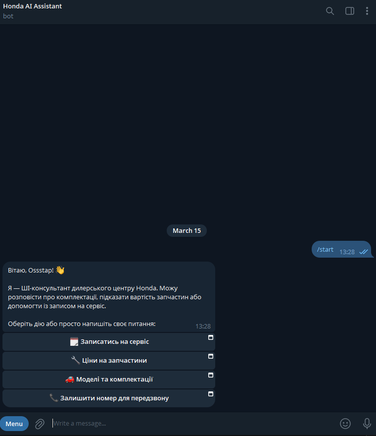
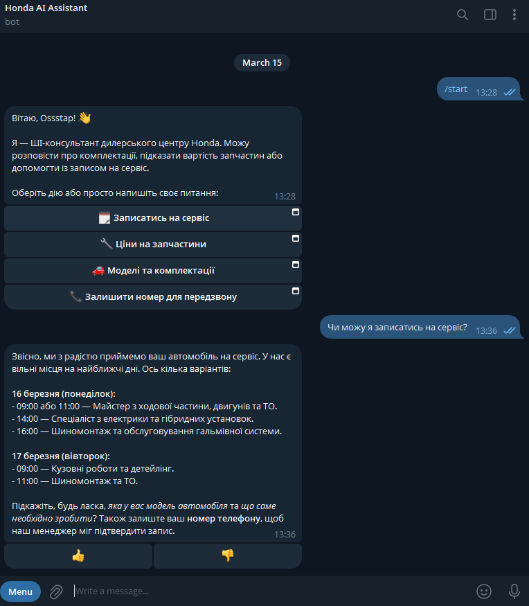
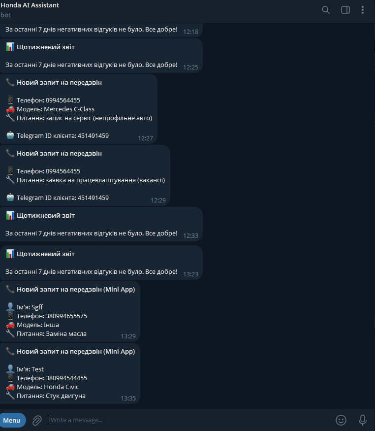
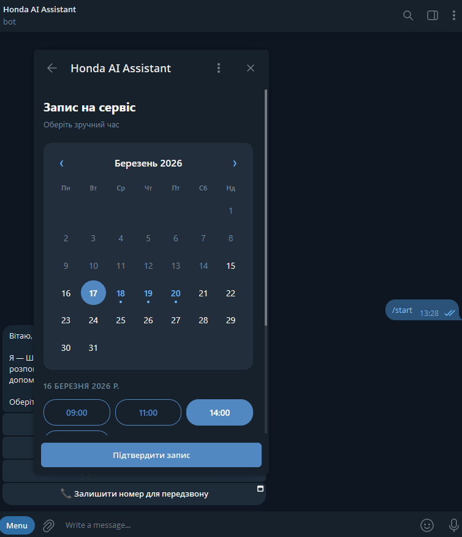
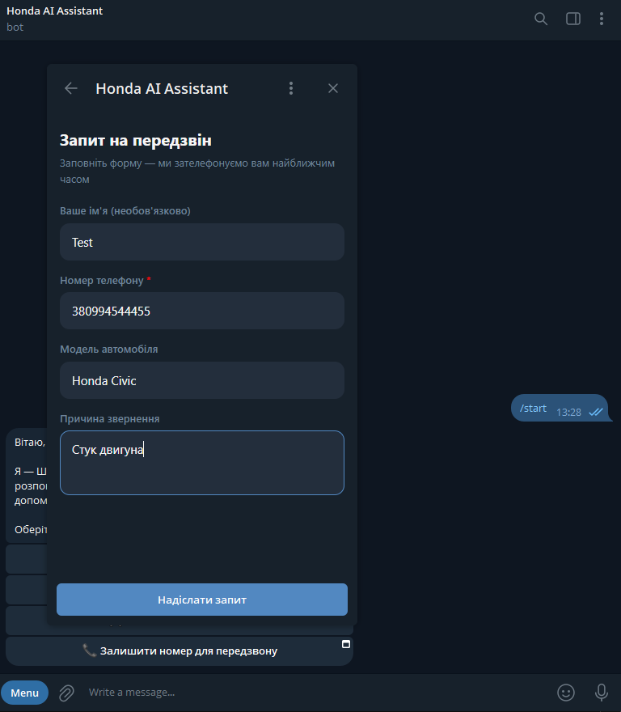
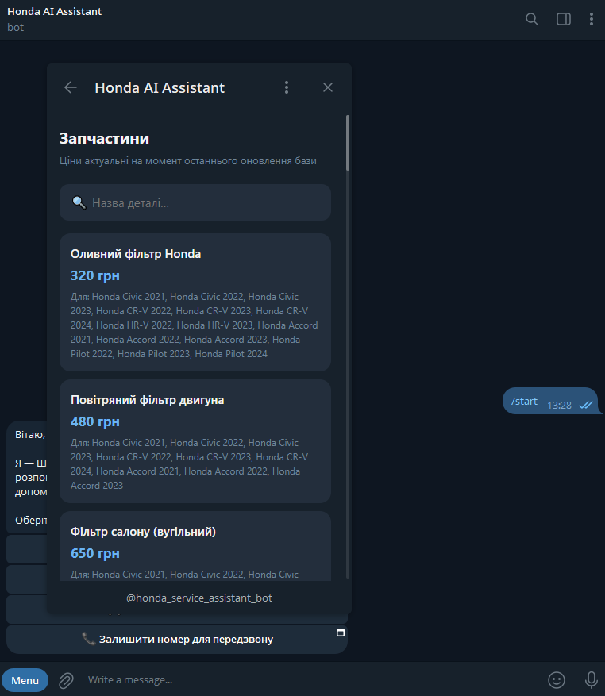
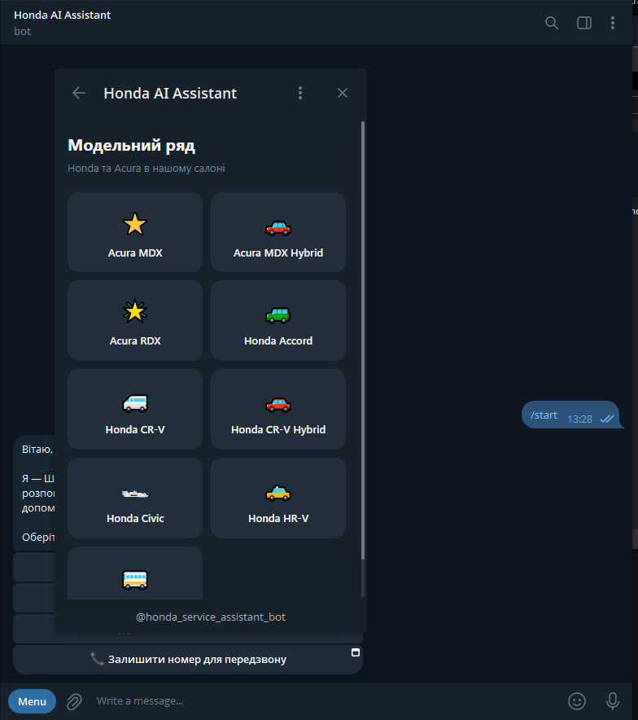

# Honda/Acura Dealership AI Assistant

Telegram bot for a Honda and Acura dealership. Helps customers check available service slots, get spare parts prices, compare car models, and request a callback — all in Ukrainian.

Built with **PydanticAI + Gemini**, **MongoDB Atlas** (vector search), **aiogram v3**, and a **Telegram Mini App** UI.

---

## Screenshots

### Bot Chat
|                Start / Menu                |                 Agent Reply                 |                     Feedback                     |
|:------------------------------------------:|:-------------------------------------------:|:------------------------------------------------:|
|  |  |    |

### Mini App
|                 Slot Calendar                  |                 Time & Phone                  |                Parts Search                 |                Model Catalog                 |
|:----------------------------------------------:|:---------------------------------------------:|:-------------------------------------------:|:--------------------------------------------:|
|  |  |  |  |

> Screenshots go in `docs/screenshots/`. Filenames match the table above.

---

## Tech Stack

| Layer | Technology |
|---|---|
| AI Agent | PydanticAI + Google Gemini (`gemini-3-flash-preview`) |
| Embeddings | `gemini-embedding-001` · `RETRIEVAL_QUERY` / `RETRIEVAL_DOCUMENT` task types |
| Vector DB | MongoDB Atlas — `$vectorSearch` on `knowledge_chunks` |
| RAG | Multi-query expansion (3 parallel searches, deduplication) |
| ODM | Beanie 2.x + Motor (async) |
| Bot framework | aiogram v3 (long polling) |
| API server | FastAPI + Uvicorn |
| Mini App | Vanilla JS/HTML served by FastAPI at `/mini-app` |
| Tunnel (dev) | ngrok static domain → FastAPI port 8000 |
| Config | pydantic-settings, `.env` file |
| Package manager | Poetry (in-project `.venv`) |

---

## Prerequisites

- Python 3.13
- [Poetry](https://python-poetry.org/docs/#installation)
- MongoDB Atlas cluster with:
  - Collections provisioned (see [Migrations](#migrations))
  - A **Vector Search index** named `vector_index` on `knowledge_chunks.embedding` (768 dimensions, cosine)
- A Telegram bot token ([BotFather](https://t.me/BotFather))
- A Google Gemini API key ([Google AI Studio](https://aistudio.google.com/))
- ngrok account with a static domain (for Mini App, optional)

---

## Local Setup

### 1. Clone and install dependencies

```bash
git clone <repo-url>
cd ai-helper-telegram
poetry install
```

### 2. Configure environment

Create a `.env` file in the project root:

```env
MONGO_DB_URL=mongodb+srv://<user>:<password>@<cluster>.mongodb.net
MONGO_DB_NAME=honda_db

GEMINI_API_KEY=your_gemini_api_key

TELEGRAM_BOT_TOKEN=your_telegram_bot_token
STAFF_CHAT_ID=0           # Telegram chat ID where callback requests and reports are forwarded
ADMIN_IDS=[123456789]     # List of Telegram user IDs with admin commands

MINI_APP_URL=             # Optional — public HTTPS URL serving mini_app/, e.g. https://xyz.ngrok-free.app/mini-app
```

> Leave `MINI_APP_URL` empty to run without the Mini App. The bot falls back to regular inline buttons automatically.

### 3. Run database migrations

```bash
poetry run python run_migrations.py
```

### 4. Seed test data (optional)

```bash
poetry run python app/seed.py
```

### 5. Populate the vector knowledge base

Add your dealership info to `data/info.md`, then embed it:

```bash
poetry run python embed_data.py
```

> The Atlas Vector Search index must be live before the bot can answer knowledge-base queries.
> Index config: name `vector_index`, field `embedding`, dimensions `768`, similarity `cosine`.

### 6. Run the Telegram bot

```bash
poetry run python run_bot.py
```

### 7. Run the FastAPI server (required for Mini App)

```bash
poetry run uvicorn app.main:app --reload
```

### 8. Enable the Mini App (optional)

Start an ngrok tunnel pointing to FastAPI:

```bash
ngrok http --domain=your-static-domain.ngrok-free.app 8000
```

Set `MINI_APP_URL=https://your-static-domain.ngrok-free.app/mini-app` in `.env` and restart the bot.

---

## Docker

```bash
# Start bot + API (Mini App served by api container)
docker-compose up bot api

# Run the weekly feedback report (one-shot)
docker-compose run --rm reporter
```

---

## Project Structure

```
ai-helper-telegram/
├── app/
│   ├── core/
│   │   ├── config.py          # pydantic-settings — reads .env
│   │   ├── database.py        # Motor + Beanie init
│   │   └── logging.py
│   ├── models/
│   │   ├── service.py         # Mechanic (specialization), ServiceSlot, Parts, ClientInfo
│   │   ├── knowledge.py       # KnowledgeChunk (vector search)
│   │   └── ligtning.py        # ChatLog, FeedbackScore
│   ├── services/
│   │   ├── ai_agent.py        # PydanticAI agent + 4 tools + multi-query RAG
│   │   ├── chat_history.py    # Persists chat turns to MongoDB
│   │   └── moderation.py      # Ban, rate limit, content violation checks
│   ├── api/
│   │   ├── mini_app.py        # Mini App API — slots, parts, models, callback
│   │   └── routers.py
│   ├── migrations/            # Beanie migration files
│   ├── main.py                # FastAPI app + static Mini App mount
│   └── seed.py                # Test data seeder
├── mini_app/                  # Telegram Mini App (vanilla JS/HTML)
│   ├── style.css              # Shared Telegram-themed styles
│   ├── slots.html             # Slot calendar → time picker → phone form
│   ├── callback.html          # Callback request form
│   ├── parts.html             # Parts price search
│   └── models.html            # Car model catalog
├── docs/
│   ├── screenshots/           # Bot and Mini App screenshots
│   └── plan.md
├── data/
│   └── info.md                # Dealership knowledge base (gitignored)
├── run_bot.py                 # Telegram bot entry point
├── report_bot.py              # Weekly feedback report (Gemini summary → admin Telegram)
├── run_migrations.py          # Migration runner
├── embed_data.py              # Chunks info.md and uploads embeddings to Atlas
├── Dockerfile
├── docker-compose.yml
├── pyproject.toml
└── .env                       # Local secrets (gitignored)
```

---

## Agent Tools

| Tool | Parameter | Description |
|---|---|---|
| `read_knowledge_base` | `search_query: str` | Multi-query RAG — 3 parallel vector searches, deduplicated results |
| `read_db_slots` | `specialization: str` | Available slots filtered by mechanic specialization (e.g. `"двигун"`, `"детейлінг"`) |
| `read_parts_price` | `search_query: str` | Regex search on `Parts` collection, returns price in UAH |
| `request_callback` | `phone, name, car_model, issue` | Forwards customer contact to `STAFF_CHAT_ID` |

---

## Mini App

The Mini App activates when `MINI_APP_URL` is set. The `/menu` keyboard switches from callback buttons to `web_app` buttons that open inside Telegram.

| Screen | URL | Description |
|---|---|---|
| Slot calendar | `/mini-app/slots.html?spec=...` | Month calendar → time picker → phone form → staff notified |
| Callback form | `/mini-app/callback.html` | Name, phone, car model, issue → staff notified |
| Parts search | `/mini-app/parts.html` | Debounced search across `car_parts` collection |
| Model catalog | `/mini-app/models.html` | Card grid → detail view → link to callback / slots |

All screens use Telegram theme colors (`--tg-theme-*` CSS variables) and work in both light and dark mode.

---

## Telegram Commands

### User commands
| Command | Description |
|---|---|
| `/start` | Start conversation, show main menu |
| `/menu` | Show quick-action keyboard (Mini App buttons if configured) |
| `/help` | List bot capabilities |
| `/reset` | Clear conversation history |

### Admin commands (visible only to `ADMIN_IDS`)
| Command | Description |
|---|---|
| `/stats` | Feedback stats for the last 7 days + last 3 negative messages |
| `/ban <user_id>` | Ban a user |
| `/unban <user_id>` | Unban a user |

---

## Feedback Loop

Each agent reply includes a 👍/👎 inline keyboard. Feedback is saved as `FeedbackScore` on the `ChatLog` document in MongoDB.

Run `report_bot.py` weekly to get a Gemini-generated analysis of all thumbs-down conversations delivered to your admin Telegram chat. Use the report to manually improve `INITIAL_SYSTEM_PROMPT` in `ai_agent.py` or the content of `data/info.md`.

---

## Moderation

Each incoming message passes through these checks in order:

1. **Ban check** — blocked users receive a one-line rejection
2. **Rate limit** — max N messages per minute per user
3. **Message length** — capped at 1 000 characters
4. **Content violation** — keyword filter; repeated violations trigger auto-ban

---

## Planned

- **MongoDB-backed session history** — replace the in-memory `user_sessions` dict
- **Webhook mode** — replace long polling with a FastAPI webhook endpoint
